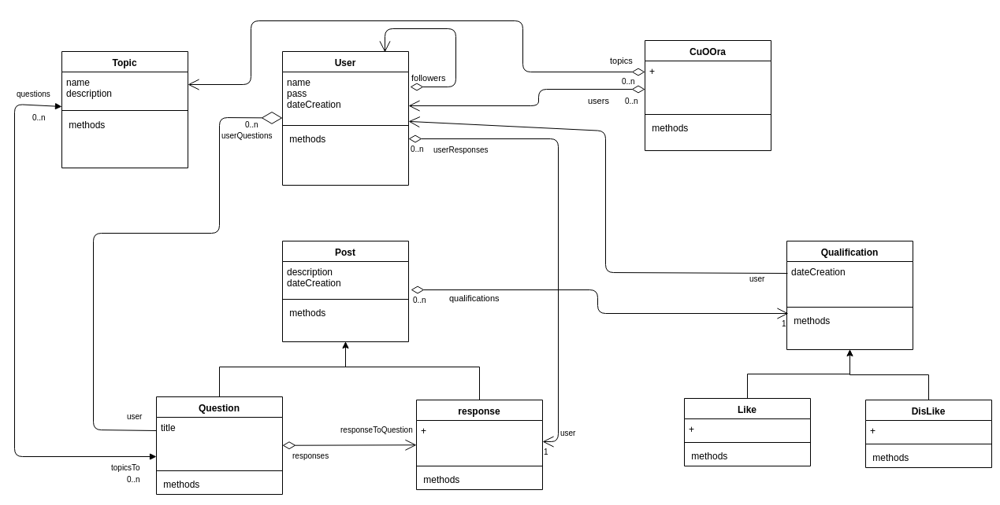

# cuooraObj1
cuooraObj1 es miniPlataforma(red social) de preguntas y respuestas en **Smalltalk** Pharo, con Seaside framework web. frontEnd modelos y test backend
donde se pueden subir post, calificar post (like dislike), seguir a otros usuarios o conseguir seguidores
UML diagram

-para iniciar servidor: Se  debe registrar el Componente   -class WACuOOra en Seaside
        
        WAAdmin register: WACuOOra  asApplicationAt: 'cuoora'
        
        
-para iniciar los modelos backend: La clase CuOOra usa el patron singleton, y la funcion "cargarPrueba" genera 3 usuarios y 3 preguntas 

      CuOOra cargarPrueba.
      
 >ejemplos usuario y contraseña : 
 -pedro@cuoora.com, 
 -juan@cuoora.com
